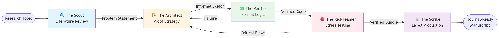

# AI Math Researcher

An autonomous multi-agent pipeline that simulates the mathematical research process — from literature review to a journal-ready LaTeX manuscript.

## How it works

Five subagents collaborate in sequence, each handing off to the next:

| Subagent | Role |
|---|---|
| `/the-scout` | Literature review — searches arXiv & Google Scholar, identifies prior art and unsolved gaps |
| `/the-architect` | Proof strategy — decomposes the conjecture into lemmas and writes an informal proof sketch |
| `/the-verifier` | Formal verification — translates the sketch into Lean 4 / Isabelle and compiles it |
| `/the-red-teamer` | Adversarial critic — stress-tests the verified proof for vacuous truths, circular reasoning, and edge cases |
| `/the-scribe` | LaTeX production — renders the verified bundle into a journal-ready manuscript (`amsart` class) |


Figure 1. High Level Workflow

## Usage

Clone the repository:

```bash
git clone https://github.com/DINHDUY/ai-math-researcher.git
cd ai-match-researcher
```

Invoke any subagent directly via Claude:

```bash
claude "use subagent /the-scout Investigate how this theorem is applied in number theory or used in cryptography"
```

The pipeline runs autonomously from there. Each subagent passes its output to the next until The Scribe produces the final `.tex` and `.pdf`.

You can also invoke any subagent individually if you want to start mid-pipeline, for example jumping straight to `/the-architect` with an existing problem statement.

## Output

Results are written to `output/` as markdown reports per subagent (e.g., `the_scout_1.md`, `the_architect_1.md`, ...).

## Example

[**How Fermat's Little Theorem is applied in number theory or used in cryptography**](output/fermat_carmichael.pdf)


